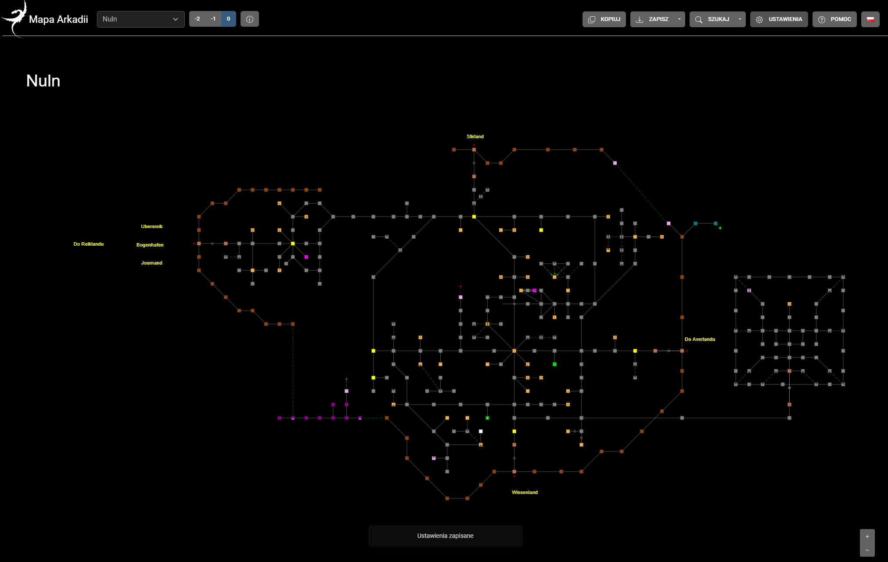

# Online Mudlet map template

Create page with own map in a matter of minutes!
Example map: https://delwing.github.io/arkadia-mapa/

## Instructions

1. Create new repository using this one as template.
2. Replace `map.dat` with your own map file
3. Replace `logo.svg` and `favicon.ico`
4. In `page/i18n/en.json` replace
    1. `%title%`
    2. `%description`
5. Optionally you can also replace ones in `page/index.html`
6. You can add npcs to be searchable in `page/data/npc.json` just as the one that it's there.
7. Push
8. Go to repository *Settings* -> *Pages*. In *Build and deployment* section set `Srouce` as `Github Actions`

Visit your page under `https://{repositoryOwner}.github.io/{repository}/` so in case if this example it is: https://delwing.github.io/online-mudlet-map-template/

## Screenshot

